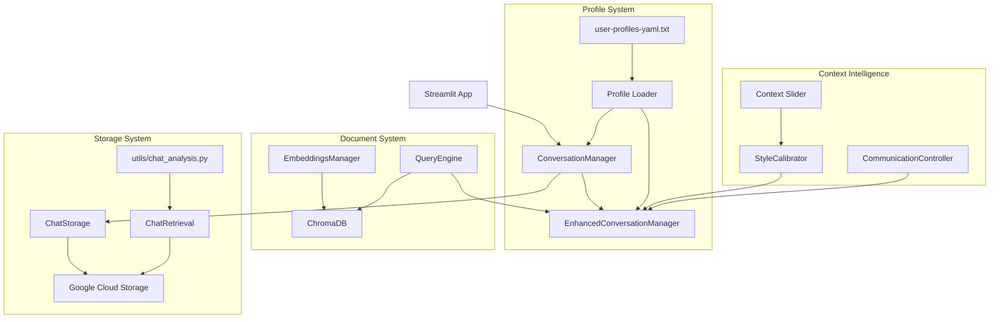
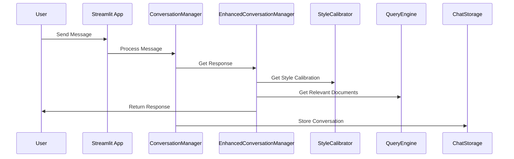
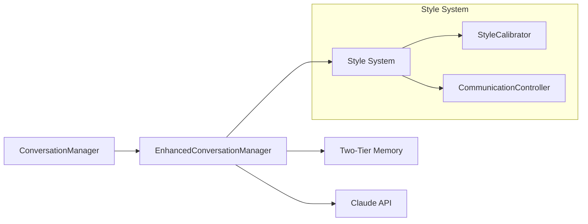
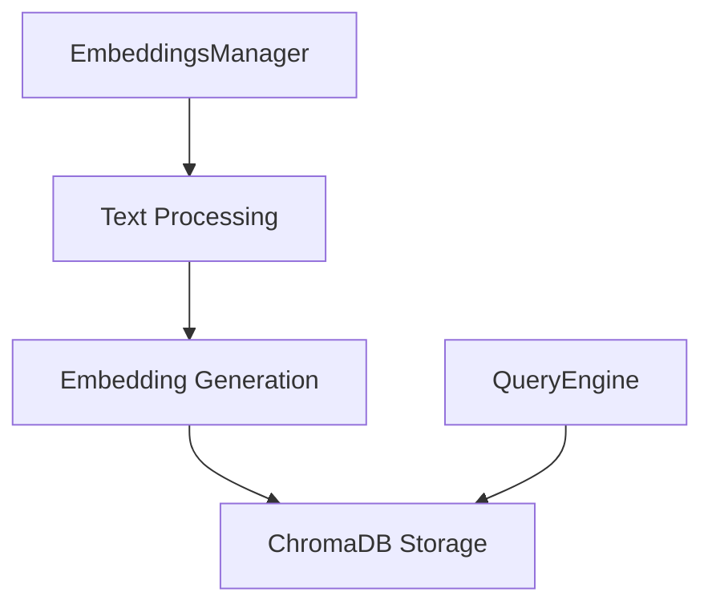
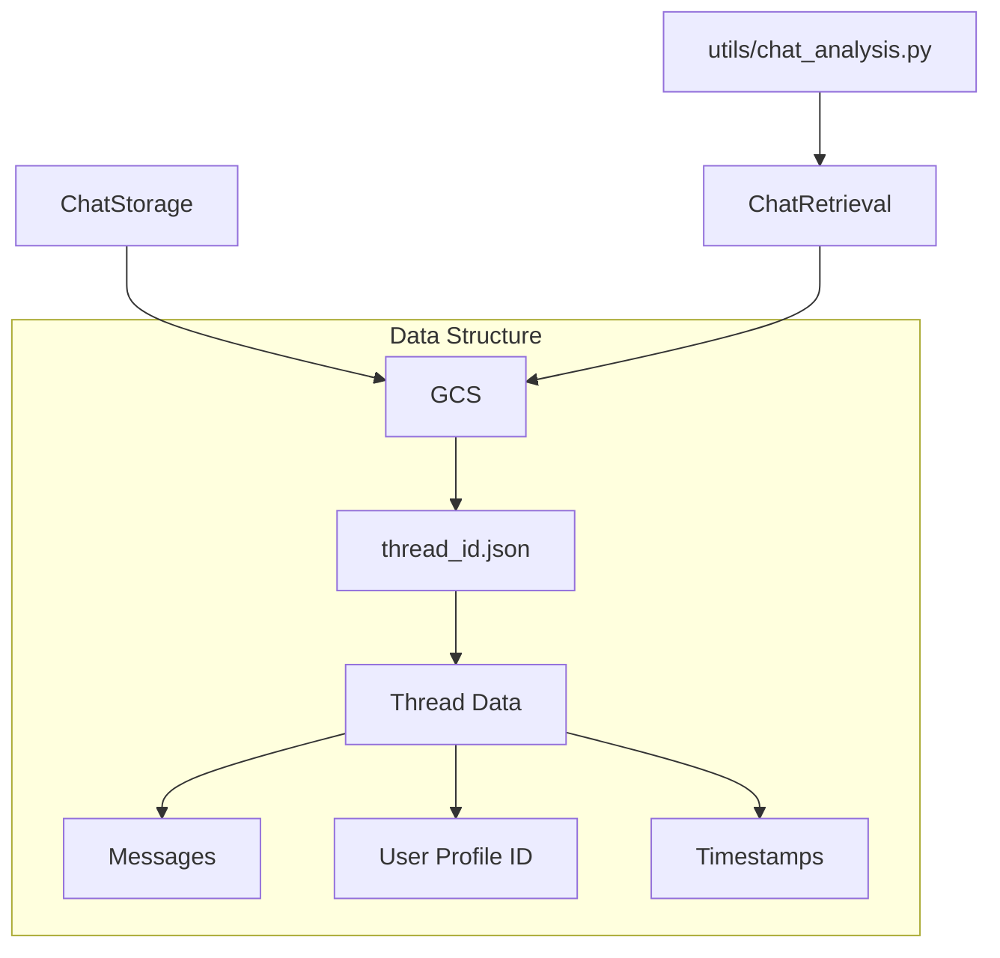
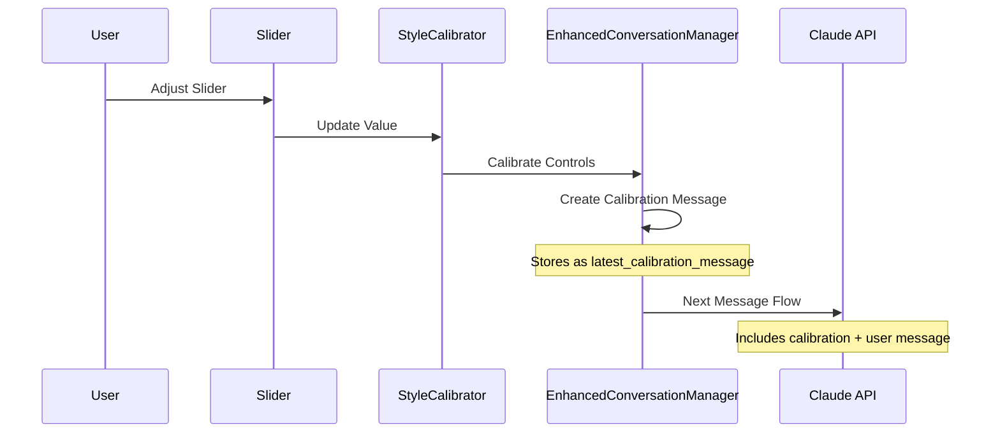
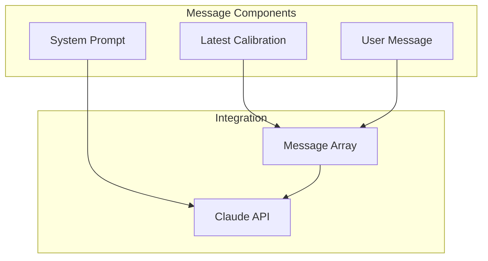

# Obi System Overview

## System Architecture



## Core Components Interaction



## System Components

### 1. User Interface Layer
- **Streamlit App (app.py)**
  - Dual-citizen interface
  - Context Intelligence slider
  - Case file display
  - Real-time chat interface

### 2. Profile Management
- **User Profiles (user-profiles-yaml.txt)**
  ```yaml
  users:
    - personal:
        full_name: str
        primary_language: str
    - metadata:
        communication_preferences:
          interaction_style: int
          detail_level: int
          rapport_level: int
  ```
- Drives system behavior
- Influences all component interactions

### 3. Conversation Processing



### 4. Document Management



### 5. Storage Architecture



### 6. Context Intelligence Flow



```
Slider Input → Style Calibration → Calibration Message Creation →
Message Integration → Response Adaptation
```

### 7. Message Flow Architecture



Key Components:
1. System Prompt
   - Base context and rules
   - Communication preferences
   - User profile information

2. Calibration Messages
   - Role: assistant
   - Format: [COMMUNICATION UPDATE]
   - Contains latest calibration values
   - Overrides previous calibrations

3. Message Integration
   - Latest calibration included before user message
   - Clear update markers for LLM recognition
   - Maintains conversation continuity

## Data Flows

### 1. Conversation Flow
```
User Input → Profile Loading → Style Calibration → 
Document Retrieval → Response Generation → Storage
```

### 2. Context Intelligence Flow
```
Slider Input → Style Calibration → Communication Control →
Enhanced Manager → Response Adaptation
```

### 3. Analysis Flow
```
Chat Retrieval → Thread Processing → Profile Analysis →
Usage Patterns → Insights Generation
```

## System Integration Points

### 1. Profile Integration
- Loaded during initialization
- Influences all components
- Drives communication style
- Affects document retrieval

### 2. Context Intelligence
- Real-time calibration
- Profile-aware adaptation
- Dynamic response styling
- Contextual understanding

### 3. Storage Integration
- Profile-linked threads
- Context-aware retrieval
- Analysis capabilities
- Security measures

## Development Considerations

### 1. Local Development
```bash
# Run development server
streamlit run dev/run_local.py

# Run analysis
python utils/chat_analysis.py [days]

# Run tests
python -m pytest tests/
```

### 2. Environment Setup
```bash
# Required variables
ANTHROPIC_API_KEY=key
GCS_BUCKET_NAME=bucket
GOOGLE_APPLICATION_CREDENTIALS=path
```

### 3. Security Measures
- Profile data protection
- Secure API handling
- Minimal permissions
- Encrypted storage

## Monitoring and Analysis

### 1. System Metrics
- Thread counts
- Response times
- Profile statistics
- Usage patterns

### 2. Analysis Tools
- Chat history analysis
- Profile effectiveness
- Context intelligence impact
- User engagement metrics

## Future Considerations

### 1. Scalability
- Profile system expansion
- Enhanced analytics
- Additional integrations
- Performance optimization

### 2. Enhancements
- Profile automation
- Advanced analytics
- Extended document support
- Integration capabilities
