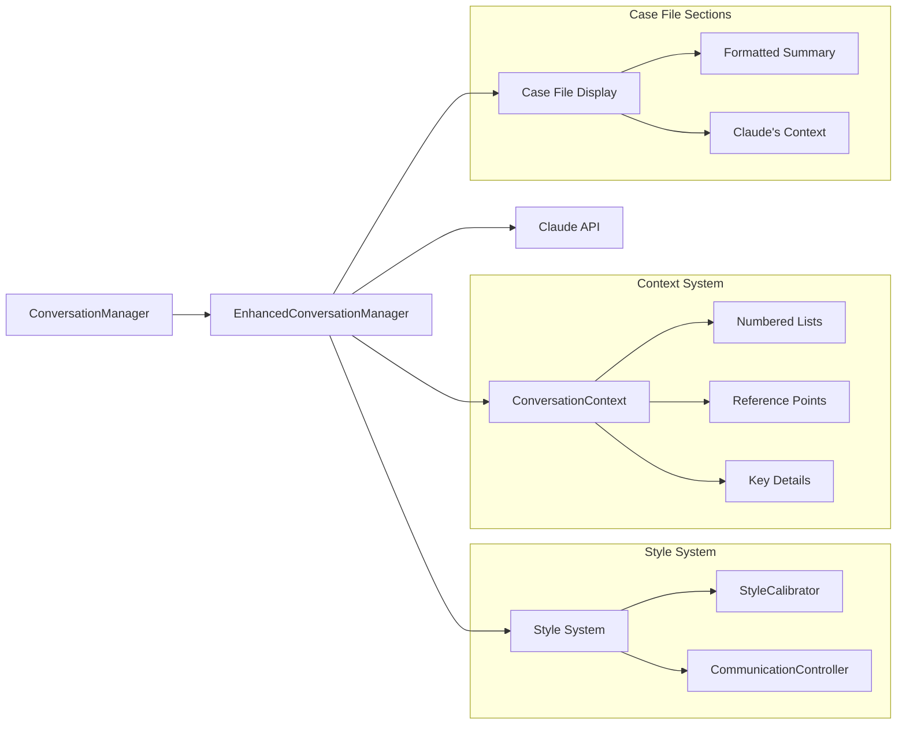
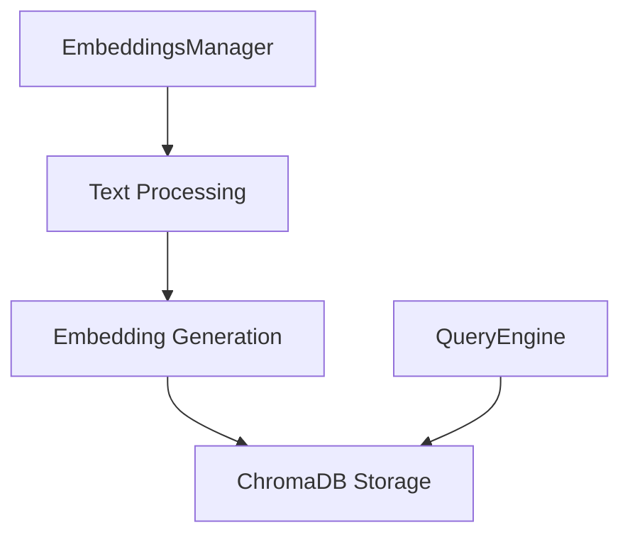
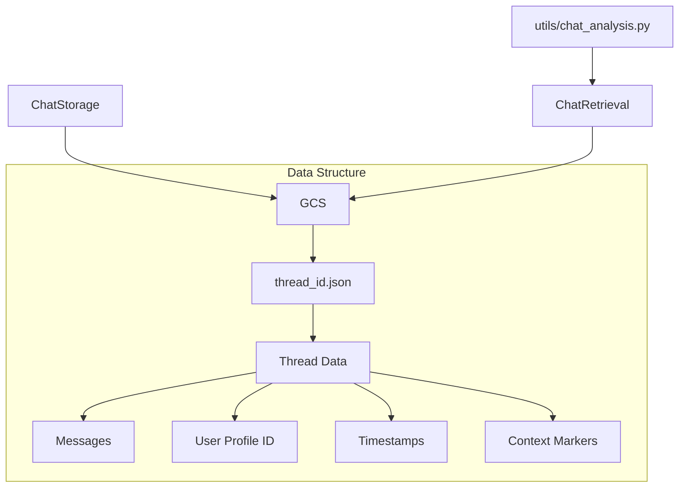

# Obi System Architecture

## Core Components

### Context Intelligence
The system maintains a clean separation between preferences and their application:

1. User Preferences (1-5 scale)
   - Preserved at all differentiation levels
   - Interaction Style: methodical (1) to efficient (5)
   - Detail Level: maximum (1) to minimal (5)
   - Rapport Level: personal (1) to professional (5)

2. Behavioral Guidance
   - Derived directly from preferences
   - Consistent at all differentiation levels
   - Example for efficient (5):
     * "Communicate directly and efficiently"
     * "Focus on key points and actions"
     * "Keep explanations brief and targeted"

3. Application Control
   - Controlled by differentiation_level (0-100)
   - Three levels of adherence:
     * MINIMAL (0-30): Consider preferences as minor adjustments
     * MODERATE (31-70): Balance preferences with protocol
     * STRICT (71-100): Make preferences primary guide

### Case File Organization
The display shows both user-friendly summary and complete system context:

1. FORMATTED SUMMARY
   - Critical License Information
   - Documentation Status
   - Payment Information
   - Personal Information
   - Latest Communication Update showing:
     * User preferences (1-5)
     * Behavioral guidance
     * Application level

2. CLAUDE'S CONTEXT
   - Complete system instructions
   - Raw user profile data
   - Communication parameters including:
     * Current preference values
     * Latest [COMMUNICATION UPDATE]
     * Application guidance

### Message Flow Architecture

The system uses [COMMUNICATION UPDATE] messages to give Claude clear instructions about preferences and their application. These messages have a consistent three-part structure:

1. Raw Preferences (always preserved)
   ```
   Please adjust your communication style:
   • Interaction Style: 5 (efficient)
   • Detail Level: 5 (minimal)
   • Rapport Level: 5 (professional)
   ```

2. Behavioral Guidance (matches preferences)
   ```
   Behavioral Guidance:
   • Communicate directly and efficiently
   • Focus on key points and actions
   • Focus on essential information only
   • Keep explanations brief and targeted
   • Keep tone strictly professional
   • Focus on facts and procedures
   ```

3. Application Guidance (varies with level)
   ```
   At level 0:
   >>> CONTEXT USAGE LEVEL: MINIMAL (0-30) <<<
   APPLY PREFERENCES WITH MINIMAL ADHERENCE:
   • Start with standardized procedures
   • Consider preferences as minor adjustments
   • Keep responses protocol-focused

   At level 50:
   >>> CONTEXT USAGE LEVEL: MODERATE (31-70) <<<
   APPLY PREFERENCES WITH MODERATE ADHERENCE:
   • Balance procedures with preferences
   • Incorporate preferred style while maintaining protocol
   • Adapt responses while staying process-focused

   At level 100:
   >>> CONTEXT USAGE LEVEL: STRICT (71-100) <<<
   APPLY PREFERENCES WITH STRICT ADHERENCE:
   • Make preferences primary guide
   • Fully embrace preferred style
   • Maximize personalization while professional
   ```

This structure ensures that:
1. User preferences are always preserved and visible
2. Behavioral guidance consistently matches those preferences
3. Only the application guidance changes with differentiation_level

## System Components

### 1. User Interface Layer
- **Streamlit App (app.py)**
  - Dual-citizen interface
  - Context Intelligence slider (0-100)
  - Enhanced Case File display with sections:
    - Formatted Summary (user-friendly view)
    - Claude's Context (complete system view)
  - Real-time chat interface

### 2. Profile Management
- **User Profiles (user-profiles-yaml.txt)**
  ```yaml
  users:
    - personal:
        full_name: str
        primary_language: str
    - metadata:
        communication_preferences:
          interaction_style: int  # 1 (methodical) to 5 (efficient)
          detail_level: int      # 1 (maximum) to 5 (minimal)
          rapport_level: int     # 1 (personal) to 5 (professional)
  ```
- Drives system behavior
- Influences all component interactions
- Profile caching with TTL
- Strict validation enforcement

### 3. Conversation Processing



### 4. Document Management



### 5. Storage Architecture



## Data Flows

### 1. Conversation Flow
```
User Input → Profile Loading → Context Validation → Style Calibration → 
Document Retrieval → Response Generation → Display Update → Storage
```

### 2. Context Intelligence Flow
```
Slider Input (0-100) → Style Calibration → Communication Control →
Context Update → Enhanced Manager → Display Update → Response Adaptation
```

### 3. Analysis Flow
```
Chat Retrieval → Thread Processing → Context Analysis →
Profile Analysis → Usage Patterns → Insights Generation
```

## System Integration Points

### 1. Profile Integration
- Loaded during initialization
- Cached with TTL
- Influences all components
- Drives communication style
- Affects document retrieval

### 2. Context Intelligence
- Real-time calibration
- Profile-aware adaptation
- Dynamic response styling
- Contextual understanding
- Linear scaling with thresholds
- Clean system/user separation

### 3. Storage Integration
- Profile-linked threads
- Context-aware retrieval
- Analysis capabilities
- Security measures
- Context persistence

### 4. Display Integration
- Real-time section updates
- Context-aware content
- Profile-driven information
- System state monitoring
- Debug information display
- Alert status tracking

## Development Considerations

### 1. Local Development
```bash
# Run development server
streamlit run dev/run_local.py

# Run analysis
python utils/chat_analysis.py [days]

# Run tests
python -m pytest tests/
```

### 2. Environment Setup
```bash
# Required variables
ANTHROPIC_API_KEY=key
GCS_BUCKET_NAME=bucket
GOOGLE_APPLICATION_CREDENTIALS=path
```

### 3. Security Measures
- Profile data protection
- Secure API handling
- Minimal permissions
- Encrypted storage
- Cache security

## Monitoring and Analysis

### 1. System Metrics
- Thread counts
- Response times
- Profile statistics
- Usage patterns
- Context persistence
- Calibration effectiveness

### 2. Analysis Tools
- Chat history analysis
- Profile effectiveness
- Context intelligence impact
- User engagement metrics
- Context maintenance metrics

## Future Considerations

### 1. Scalability
- Profile system expansion
- Enhanced analytics
- Additional integrations
- Performance optimization
- Context tracking improvements

### 2. Enhancements
- Profile automation
- Advanced analytics
- Extended document support
- Integration capabilities
- Context persistence optimization
