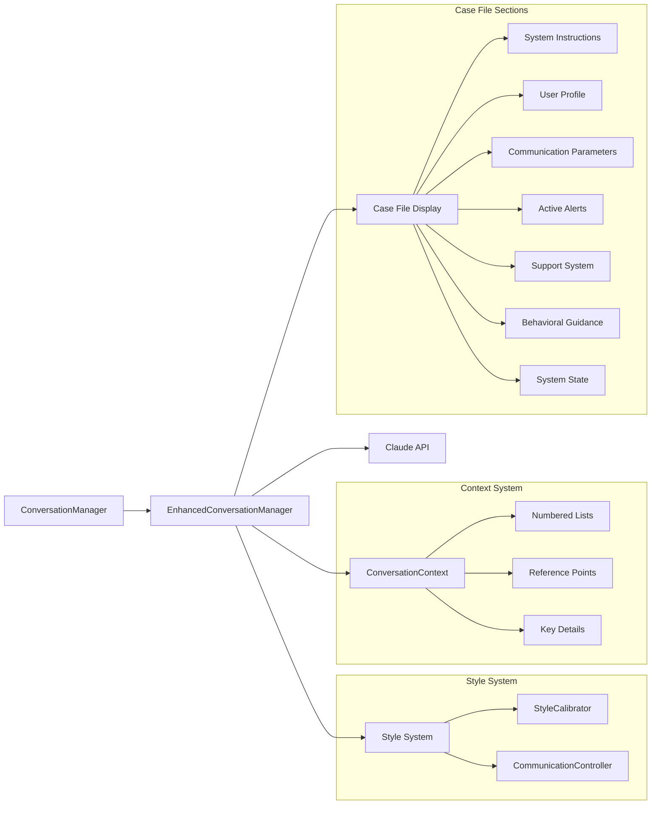

# Obi System Overview

## System Architecture


## Core Components Interaction


## System Components

### 1. User Interface Layer
- **Streamlit App (app.py)**
  - Dual-citizen interface
  - Context Intelligence slider (0-100)
  - Enhanced Case File display with sections:
    - System Instructions
    - User Profile
    - Communication Parameters
    - Active Alerts
    - Support System
    - Behavioral Guidance
    - System State
  - Real-time chat interface

### 2. Profile Management
- **User Profiles (user-profiles-yaml.txt)**
  ```yaml
  users:
    - personal:
        full_name: str
        primary_language: str
    - metadata:
        communication_preferences:
          interaction_style: int
          detail_level: int
          rapport_level: int
  ```
- Drives system behavior
- Influences all component interactions
- Profile caching with TTL
- Strict validation enforcement

### 3. Conversation Processing



### 4. Document Management


### 5. Storage Architecture


### 6. Context Intelligence Flow


```
Slider Input (0-100) → Style Calibration → Context Update →
Calibration Message Creation → Display Update → Message Integration → Response Adaptation
```

### 7. Message Flow Architecture


Key Components:
1. System Prompt
   - Base context and rules
   - Communication preferences
   - User profile information

2. Calibration Messages
   - Role: assistant
   - Format: [COMMUNICATION UPDATE]
   - Contains latest calibration values
   - Overrides previous calibrations

3. Context Markers
   - Numbered lists tracking
   - Reference points
   - Key details storage
   - Conversation memory

4. Message Integration
   - Latest calibration included before user message
   - Context markers maintained
   - Clear update markers for LLM recognition
   - Maintains conversation continuity

## Data Flows

### 1. Conversation Flow
```
User Input → Profile Loading → Context Validation → Style Calibration → 
Document Retrieval → Response Generation → Display Update → Storage
```

### 2. Context Intelligence Flow
```
Slider Input (0-100) → Style Calibration → Communication Control →
Context Update → Enhanced Manager → Display Update → Response Adaptation
```

### 3. Analysis Flow
```
Chat Retrieval → Thread Processing → Context Analysis →
Profile Analysis → Usage Patterns → Insights Generation
```

## System Integration Points

### 1. Profile Integration
- Loaded during initialization
- Cached with TTL
- Influences all components
- Drives communication style
- Affects document retrieval

### 2. Context Intelligence
- Real-time calibration
- Profile-aware adaptation
- Dynamic response styling
- Contextual understanding
- Linear scaling with thresholds
- Clean system/user separation

### 3. Storage Integration
- Profile-linked threads
- Context-aware retrieval
- Analysis capabilities
- Security measures
- Context persistence

### 4. Display Integration
- Real-time section updates
- Context-aware content
- Profile-driven information
- System state monitoring
- Debug information display
- Alert status tracking

## Development Considerations

### 1. Local Development
```bash
# Run development server
streamlit run dev/run_local.py

# Run analysis
python utils/chat_analysis.py [days]

# Run tests
python -m pytest tests/
```

### 2. Environment Setup
```bash
# Required variables
ANTHROPIC_API_KEY=key
GCS_BUCKET_NAME=bucket
GOOGLE_APPLICATION_CREDENTIALS=path
```

### 3. Security Measures
- Profile data protection
- Secure API handling
- Minimal permissions
- Encrypted storage
- Cache security

## Monitoring and Analysis

### 1. System Metrics
- Thread counts
- Response times
- Profile statistics
- Usage patterns
- Context persistence
- Calibration effectiveness

### 2. Analysis Tools
- Chat history analysis
- Profile effectiveness
- Context intelligence impact
- User engagement metrics
- Context maintenance metrics

## Future Considerations

### 1. Scalability
- Profile system expansion
- Enhanced analytics
- Additional integrations
- Performance optimization
- Context tracking improvements

### 2. Enhancements
- Profile automation
- Advanced analytics
- Extended document support
- Integration capabilities
- Context persistence optimization
