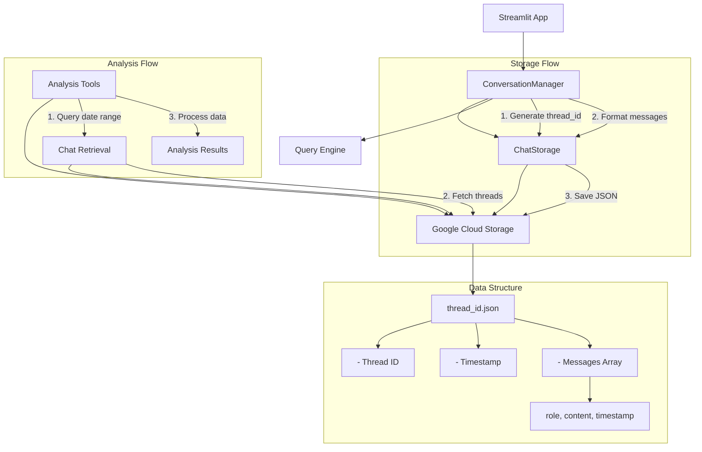

# Chat Storage System Overview



## Component Roles

1. **ConversationManager**
   - Manages chat state
   - Generates responses
   - Triggers storage after each exchange

2. **ChatStorage**
   - Handles GCS interactions
   - Formats data for storage
   - Manages thread updates

3. **Chat Retrieval**
   - Provides query interfaces
   - Handles date range searches
   - Returns formatted thread data

4. **Analysis Tools**
   - Processes chat histories
   - Generates insights
   - Tracks usage patterns

## Data Flow

1. **Chat Flow**
   ```
   User Message → ConversationManager → Response Generation → 
   Message Storage → GCS → Analysis Available
   ```

2. **Analysis Flow**
   ```
   Query Parameters → Chat Retrieval → Raw Thread Data → 
   Analysis Processing → Insights
   ```

## Security & Privacy

1. **Data Storage**
   - Thread IDs are UUIDs
   - No PII beyond chat content
   - System messages excluded

2. **Access Control**
   - Minimal GCS permissions
   - Service account authentication
   - Bucket-level security

## Usage Patterns

1. **Real-time Storage**
   - Automatic thread creation
   - Immediate message persistence
   - Fault-tolerant design

2. **Analysis Capabilities**
   - Message patterns
   - Topic frequency
   - Usage trends
   - Duration analysis

## Implementation Notes

1. **Environment Setup**
   ```
   GCS_BUCKET_NAME=bucket-name
   GOOGLE_APPLICATION_CREDENTIALS_JSON=service-account-json
   ```

2. **Testing**
   ```bash
   # Run storage tests
   python tests/test_chat_storage.py

   # Run analysis
   python analysis/chat_analysis.py [days]
   ```

3. **Monitoring**
   - Check GCS console for stored threads
   - Run analysis script periodically
   - Monitor storage usage
